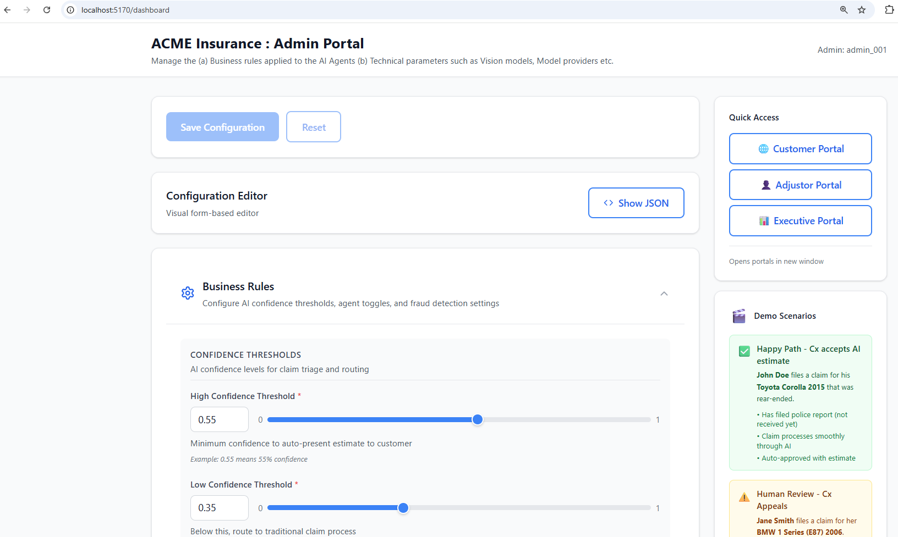

# ACME Insurance - AI Claims Management System

**Purpose**: Demonstration of AI-based auto claim adjudication

This project showcases how AI can streamline insurance claims processing through automated damage detection, fraud analysis, cost estimation, and intelligent routing - reducing claim processing time from days to minutes while maintaining accuracy and fraud prevention.

**Key Technologies**: YOLO damage detection, Vision Language Models for fraud detection, multi-portal architecture for different user roles.

## Prerequisites

This project requires **uv** (fast Python package installer):

```bash
# Install uv
curl -LsSf https://astral.sh/uv/install.sh | sh

# Or run the setup script (one-time setup)
./scripts/setup_uv.sh
```

## Quick Start

### 1. Start API Server

```bash
# From project root - create database and seed demo data
./scripts/start-api-server.sh --clean

# To continue with existing data (skip --clean flag)
./scripts/start-api-server.sh
```

The API server will start on port 8000. Access API docs at: http://localhost:8000/docs

### 2. Start All Portals

```bash
# From project root - starts all 4 portals
./scripts/start-portals.sh
```

This starts:
- Customer Portal: http://localhost:5173
- Adjustor Portal: http://localhost:5174
- Admin Portal: http://localhost:5170
- Executive Portal: http://localhost:5175

### 3. Open Admin Portal

Navigate to **http://localhost:5170** in your browser:



From the Admin Portal, you can launch the Customer, Adjustor, and Executive portals using the **Quick Access** panel on the right side.

## What's Built

### Backend API (FastAPI)
- YOLO-based damage detection (real-time during upload)
- AI fraud detection (VLM + multi-signal analysis)
- Cost estimation engine
- Customer chatbot (Claude + RAG)
- Complete claim lifecycle management

### Customer Portal
- File claims with photo upload
- Real-time AI damage analysis
- Instant repair estimates
- Appeal decisions
- Mobile QR code support

### Adjustor Portal
- Review flagged claims
- Manual damage assessment
- Fraud signal analysis
- Cost estimate adjustments
- SOP reference viewer

### Admin Portal
- Configure AI thresholds
- Toggle fraud detection features
- Manage business rules
- View demo scenarios

### Executive Portal
- 6-month historical analytics
- KPI dashboards
- Fraud detection metrics
- Cost savings analysis

## Demo Scenarios

Test images are provided in the `images/` directory. Use these images when filing claims through the Customer Portal.

### 1. Happy Path - Auto-Approved
- **Customer**: John Doe (#100)
- **Vehicle**: 2015 Toyota Corolla (Silver)
- **Image**: `images/toyota-rear-end-damage.png`
- **Expected**: Auto-approved with AI estimate
- **Outcome**: Customer accepts estimate

### 2. Customer Appeal - Human Review
- **Customer**: Jane Smith (#101)
- **Vehicle**: 2006 BMW 1 Series E87 (Silver)
- **Image**: `images/bmw-silver-2006-front-damaged.png`
- **Expected**: AI estimate presented, customer appeals
- **Appeal Reason**: "Radiator seems to be damaged beyond repair"
- **Outcome**: Adjustor adds manual damage and revises estimate

### 3. Fraud Detection - Make Mismatch
- **Customer**: Bob Johnson (#102)
- **Vehicle**: 2012 Chevy Silverado (Red)
- **Images**: 
  - Upload: `images/red-ford-f150-ai-generated-damage.jpg` (Ford F-150)
  - Note: Vehicle mismatch (Chevy ≠ Ford)
- **Expected**: Fraud signals detected
- **Outcome**: Routed to adjustor for fraud review

### 4. Fraud Detection - AI Generated Image
- **Customer**: Alice Williams (#103)
- **Vehicle**: 2022 Honda Accord (Black)
- **Image**: `images/honda-acord-ex-2022-ai-generated-damage.jpg`
- **Expected**: AI-generated damage detected by VLM
- **Outcome**: Routed to fraud review with AI generation analysis

**Default password for all portals**: `password`

**Additional Test Images**:
- `images/damaged-car-1.jpg` - General damage
- `images/damaged-car-dent-2.jpg` - Dent damage
- `images/damaged-car-front-bumper-3.jpg` - Front bumper
- `images/damaged-car-back-bumper-4.jpg` - Back bumper
- `images/damaged-car-door-5.jpg` - Door damage
- `images/red-ford-f150-no-damage.jpg` - Undamaged Ford F-150

## Project Structure

```
├── src/
│   ├── api/              # FastAPI backend
│   ├── ui/
│   │   ├── customer/     # Customer portal (React)
│   │   ├── adjustor/     # Adjustor portal (React)
│   │   ├── admin/        # Admin portal (React)
│   │   └── executive/    # Executive portal (React)
│   └── data/             # Warehouse data, FAQs
├── scripts/              # Setup and seed scripts
├── specifications/       # Design docs and SOPs
└── simulation/           # Data generation scripts
```

## Technology Stack

- **Backend**: FastAPI, SQLAlchemy, SQLite
- **AI/ML**: YOLO v8, Claude (Anthropic), AWS Bedrock
- **Frontend**: React 18, Vite, Tailwind CSS, Recharts
- **Data**: DuckDB (warehouse), SQLite (operational)

## Key Features

✅ Real-time damage detection (YOLO)  
✅ AI fraud detection (make/model mismatch, AI-generated images)  
✅ Instant cost estimation  
✅ Customer chatbot with RAG  
✅ Human review workflow  
✅ Executive analytics dashboards  
✅ Configurable business rules  
✅ Complete audit trail

## Documentation

- [Quick Start Guide](specifications/QUICK-START-UV.md)
- [API Design](specifications/API-BACKEND-DESIGN.md)
- [Customer Portal](specifications/UI-CUSTOMER-PORTAL-DESIGN.md)
- [Adjustor Portal](specifications/UI-ADJUSTOR-PORTAL-DESIGN.md)
- [Admin Portal](specifications/UI-ADMIN-PORTAL-DESIGN.md)
- [Executive Portal](specifications/UI-EXECUTIVES-PORTAL-DESIGN.md)
- [SOP - Damage Triage](specifications/policies/sop_damage_triage.md)

## References

### External Resources

- [Car Damage Assessment AI](https://github.com/artemxdata/Car-Damage-Assessment-AI)
- [AAA Mechanic Labor Rates](https://www.aaa.com/autorepair/articles/average-mechanic-labor-rate-repair-costs-in-your-state-2026)
- [COCO Car Damage Dataset](https://www.kaggle.com/datasets/lplenka/coco-car-damage-detection-dataset)
- [YOLO v8 Tutorial](https://www.digitalocean.com/community/tutorials/yolov8)

### Technical Diagrams

Mermaid diagrams illustrating system architecture and workflows:

- [AI-Powered Claim Flow](specifications/diagrams/claim-flow-with-ai.mmd) - End-to-end claim processing with AI
- [Traditional Claims Process](specifications/diagrams/traditional-claims.mmd) - Comparison: traditional vs AI workflow
- [Claim State Machine](specifications/diagrams/claims-state-machine.mmd) - Claim lifecycle states and transitions
- [Image Upload Flow](specifications/diagrams/claim_image_upload.mmd) - YOLO damage detection during upload
- [Fraud Detection Agent](specifications/diagrams/customer-fraud-ai-agent.mmd) - AI fraud detection workflow
- [Database ERD](specifications/diagrams/claim-database-erd.mmd) - Data model and relationships

---

## FAQ

### Can I try my own images?

Yes! You can upload your own vehicle damage images through the Customer Portal when filing a claim. The system will analyze any clear photos of vehicle damage.

### How can I use my own LLM provider?

The system supports multiple LLM providers (Anthropic, OpenAI, AWS Bedrock). You can configure your preferred provider and API keys in the `api-config.yaml` file or through the Admin Portal.

### Where can I set the LLM or VLM to use?

Configure LLM and Vision Language Model (VLM) settings in two ways:
1. **Admin Portal**: Navigate to http://localhost:5170 → Business Rules → Technical Parameters section
2. **Configuration File**: Edit `api-config.yaml` in the project root

You can set the default provider, model selection, temperature, tokens, and other parameters.

### Which version of YOLO are you using?

The system uses **YOLO v8** for real-time vehicle damage detection.

### Did you fine-tune the YOLO model?

No, we are using an open-source fine-tuned version of YOLO v8 from HuggingFace that has been pre-trained on vehicle damage detection datasets.

### Are you showing real data in the Executive Portal?

No, we are using **synthetically generated data** driven by multiple auto industry averages for realistic data generation. 

We simulate a **Data Warehouse** for ACME claims data. This warehouse holds the data in a **flattened structure** optimized for analytics queries. The Executive dashboard runs off this warehouse structure, demonstrating how business intelligence and reporting would work in a production system.

The 6-month historical analytics, KPIs, and metrics are simulated to demonstrate the types of insights an executive dashboard would provide.

### Is this system ready for production?

No, this is a **demonstration and starting point** for anyone interested in AI-based auto claim adjudication. For production use, you would need:
- Enhanced security and authentication
- Scalable infrastructure
- Compliance with insurance regulations
- Additional fraud prevention measures
- Comprehensive testing and validation
- Integration with existing insurance systems

---

## License

MIT License

Copyright (c) 2026 ACME Insurance - AI Claims Management System

Permission is hereby granted, free of charge, to any person obtaining a copy
of this software and associated documentation files (the "Software"), to deal
in the Software without restriction, including without limitation the rights
to use, copy, modify, merge, publish, distribute, sublicense, and/or sell
copies of the Software, and to permit persons to whom the Software is
furnished to do so, subject to the following conditions:

The above copyright notice and this permission notice shall be included in all
copies or substantial portions of the Software.

THE SOFTWARE IS PROVIDED "AS IS", WITHOUT WARRANTY OF ANY KIND, EXPRESS OR
IMPLIED, INCLUDING BUT NOT LIMITED TO THE WARRANTIES OF MERCHANTABILITY,
FITNESS FOR A PARTICULAR PURPOSE AND NONINFRINGEMENT. IN NO EVENT SHALL THE
AUTHORS OR COPYRIGHT HOLDERS BE LIABLE FOR ANY CLAIM, DAMAGES OR OTHER
LIABILITY, WHETHER IN AN ACTION OF CONTRACT, TORT OR OTHERWISE, ARISING FROM,
OUT OF OR IN CONNECTION WITH THE SOFTWARE OR THE USE OR OTHER DEALINGS IN THE
SOFTWARE.