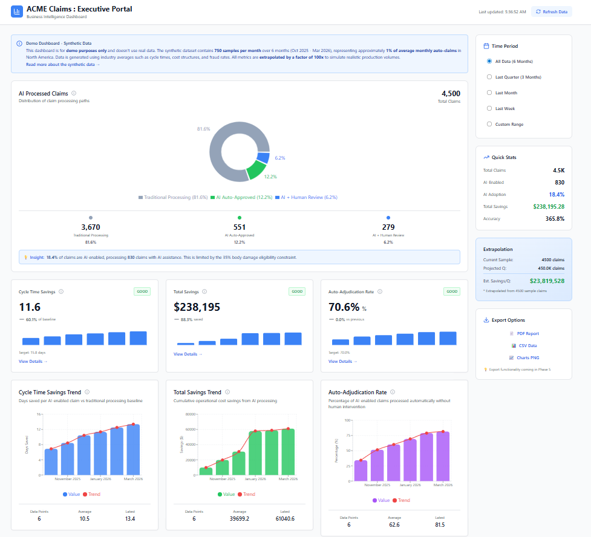

<a id="readme-top"></a>

<!-- PROJECT SHIELDS -->
[![MIT License][license-shield]][license-url]
[![LinkedIn][linkedin-shield]][linkedin-url]

<!-- PROJECT LOGO -->
<br />
<div align="center">
  <a href="https://github.com/rsakhuja/Acme-Claim-Management-Solution">
    
  </a>

  <h3 align="center">ACME Insurance - AI Claims Management System</h3>

  <p align="center">
    Demonstration of AI-based auto claim adjudication that reduces claim processing time from days to minutes
    <br />
    <a href="specifications/"><strong>Explore the docs »</strong></a>
    <br />
    <br />
    <a href="#demo-scenarios">View Demo Videos</a>
    ·
    <a href="#ai-enabled-claims-process-flow">Claim Proces flow video</a>
    ·
    <a href="#getting-started">Get started</a>
  </p>
</div>

<!-- TABLE OF CONTENTS -->
## Table of Contents
<ol>
  <li>
    <a href="#about-the-project">About The Project</a>
    <ul>
      <li><a href="#key-features">Key Features</a></li>
      <li><a href="#built-with">Built With</a></li>
    </ul>
  </li>
  <li>
    <a href="#getting-started">Getting Started</a>
    <ul>
      <li><a href="#prerequisites">Prerequisites</a></li>
      <li><a href="#installation">Installation</a></li>
      <li><a href="#configuration">Configuration</a></li>
    </ul>
  </li>
  <li><a href="#usage">Usage</a></li>
  <li><a href="#ai-enabled-claims-process-flow">AI Enabled Claims Process Flow</a></li>
  <li><a href="#additional-capabilities-beyond-scope">Additional Capabilities Beyond Scope</a></li>
  <li><a href="#demo-scenarios">Demo Scenarios</a></li>
  <li>
    <a href="#executive-dashboard">Executive Dashboard</a>
    <ul>
      <li><a href="#synthetic-data-generation">Synthetic Data Generation</a></li>
    </ul>
  </li>
  <li><a href="#langfuse-integration">Langfuse Integration</a></li>
  <li>
    <a href="#how-this-prototype-was-built">How This Prototype Was Built</a>
    <ul>
      <li><a href="#development-process">Development Process</a></li>
    </ul>
  </li>
  <li>
    <a href="#architecture--ai-flow">Architecture & AI Flow</a>
    <ul>
      <li><a href="#data-flow-overview">Data Flow Overview</a></li>
      <li><a href="#why-these-tools">Why These Tools?</a></li>
      <li><a href="#ai-agent-coordination">AI Agent Coordination</a></li>
    </ul>
  </li>
  <li><a href="#whats-built">What's Built</a></li>
  <li><a href="#potential-improvements-prototype">Potential improvements (prototype)</a></li>
  <li>
    <a href="#documentation">Documentation</a>
    <ul>
      <li><a href="#technical-diagrams">Technical Diagrams</a></li>
    </ul>
  </li>
  <li><a href="#faq">FAQ</a></li>
  <li><a href="#license">License</a></li>
  <li><a href="#contact">Contact</a></li>
  <li><a href="#acknowledgments">Acknowledgments</a></li>
</ol>

<!-- ABOUT THE PROJECT -->
## About The Project
This project builds a complete **AI-powered auto insurance claims management system** with multiple portals serving different stakeholders. It showcases how AI can streamline insurance claims processing through automated damage detection, fraud analysis, cost estimation, and intelligent routing. The system demonstrates reducing claim processing time from days to minutes while maintaining accuracy and fraud prevention.

**What Gets Built:**
- **Admin Portal** (shown below) - Central configuration hub for managing AI thresholds, business rules, and launching all portals
- **FastAPI Backend** - REST API with AI agents for damage detection (YOLO), fraud analysis (VLM), cost estimation, and customer chatbot
- **Customer Portal** - Self-service claim filing with photo upload, real-time AI damage analysis, and instant estimates
- **Adjustor Portal** - Review flagged claims, manual damage assessment, fraud investigation, and estimate adjustments
- **Executive Portal** - Analytics dashboards with KPIs, fraud metrics, and 6-month historical insights

The screenshot below shows the **Admin Portal**, which serves as the central configuration hub where users can manage system settings and launch the three operational portals for auto insurance customers, insurance adjustors, and executives.

**Key Technologies**: YOLO damage detection, Vision Language Models for fraud detection, multi-portal architecture for different user roles.

[![ACME Admin Portal][product-screenshot]](https://github.com/rsakhuja/Acme-Claim-Management-Solution)


### Key Features

* **Real-time Damage Detection** - YOLO v8 analyzes vehicle damage during image upload
* **AI Fraud Detection** - Detects make/model mismatches and AI-generated images
* **Instant Cost Estimation** - Automated repair cost calculation based on AI damage analysis
* **Customer Chatbot** - Claude-powered assistant with RAG for policy questions
* **Human Review Workflow** - Seamless handoff to adjustors for complex cases
* **Executive Analytics** - Comprehensive dashboards with 6-month historical insights
* **Configurable Business Rules** - Real-time parameter adjustments via Admin Portal
* **Complete Audit Trail** - Track all claim activities and decisions

<p align="right">(<a href="#readme-top">back to top</a>)</p>

### Built With

* [![Python][Python.org]][Python-url]
* [![FastAPI][FastAPI.com]][FastAPI-url]
* [![React][React.js]][React-url]
* [![Vite][Vite.js]][Vite-url]
* [![TailwindCSS][Tailwind.com]][Tailwind-url]
* [![SQLite][SQLite.org]][SQLite-url]
* [![AWS][AWS.amazon.com]][AWS-url]
* [![Anthropic][Anthropic.com]][Anthropic-url]

These components were chosen for speed and ease of development. **SQLite** simplifies setup and cleanup during prototyping with zero configuration. **FastAPI** and **Vite** provide hot-reloading, allowing code changes to reflect instantly without server restarts—critical for rapid iteration. Since UI is essential for effective demos, **React** and **TailwindCSS** enable building polished interfaces quickly with reusable components. 

<p align="right">(<a href="#readme-top">back to top</a>)</p>

<!-- GETTING STARTED -->
## Getting Started

Complete setup in 5 steps to get your local environment running.

### Prerequisites

* **Python 3.11+**
  ```bash
  python3 --version  # Should be 3.11 or higher
  ```

* **uv** (Python Package Manager)
  ```bash
  curl -LsSf https://astral.sh/uv/install.sh | sh
  uv --version
  ```

* **Node.js 18+ and npm 9+**
  ```bash
  node --version  # Should be v18.x or higher
  npm --version   # Should be 9.x or higher
  ```

### Installation

1. Clone the repository
   ```bash
   git clone https://github.com/rsakhuja/Acme-Claim-Management-Solution.git
   cd Acme-Claim-Management-Solution
   ```

2. Install UI dependencies for all portals
   ```bash
   ./scripts/install-ui-dependencies.sh --clean
   ```

3. Create `.env` file with your LLM provider API keys
   ```bash
   touch .env
   ```

4. Add at least one LLM provider configuration to `.env`:

   **AWS Bedrock (Default)**
   ```env
   AWS_ACCESS_KEY_ID=your_access_key
   AWS_SECRET_ACCESS_KEY=your_secret_key
   AWS_DEFAULT_REGION=us-east-1
   ```
   
   > **Note**: If you already have AWS credentials in `~/.aws/credentials`, you can skip adding AWS variables to `.env`. The system checks `~/.aws/credentials` first, then falls back to `.env`.

   **Anthropic Claude**
   ```env
   ANTHROPIC_API_KEY=sk-ant-api03-your_key_here
   ```

   **OpenAI**
   ```env
   OPENAI_API_KEY=sk-your_key_here
   ```

5. Set the LLM provider in the api-config.yaml
    ```yaml
    # Edit api-config.yaml
    llm:
      default_provider: "bedrock"  # Options: "bedrock" | "anthropic" | "openai"
    ```

6. Start the API server
   ```bash
   ./scripts/start-api-server.sh --clean
   ```
   
   > **Note**: Wait for the API server to start before proceeding to the next step. You will see the message in console: "INFO:     Application startup complete."

7. Start all UI portals
   ```bash
   ./scripts/start-portals.sh
   ```

8. Open the Admin portal in your browser
   ```
   http://localhost:5170/dashboard
   ```

<p align="right">(<a href="#readme-top">back to top</a>)</p>

### Configuration

The system uses **AWS Bedrock** by default. To switch LLM providers:

**Method 1: Configuration File**
```yaml
# Edit api-config.yaml
llm:
  default_provider: "anthropic"  # Options: "bedrock" | "anthropic" | "openai"
```

**Method 2: Admin Portal**
1. Open http://localhost:5170
2. Navigate to **Technical Parameters**
3. Select provider from **Default LLM Provider** dropdown
4. Click **Save Configuration** (changes take effect immediately)

For detailed configuration options, see [Configuration Management](#configuration-management) in the full documentation.

<p align="right">(<a href="#readme-top">back to top</a>)</p>

<!-- USAGE -->
## Usage

### Access the Portals

Admin portal is the main portal. Access this portal and you can open other portals from there.
* **Admin Portal**: http://localhost:5170 - Configure AI thresholds, manage business rules

Direct access to other portals.

* **Customer Portal**: http://localhost:5173 - File claims, upload damage photos, chat with AI assistant
* **Adjustor Portal**: http://localhost:5174 - Review flagged claims, adjust estimates, fraud analysis
* **Executive Portal**: http://localhost:5175 - View analytics dashboards and KPIs

**Default password for all portals**: `password`


## AI Enabled Claims Process Flow

The video below walks throught AI enabled claim process implemented in the prototype.


[Watch on YouTube](https://youtu.be/htb47B7IDjw)

https://github.com/user-attachments/assets/cdd8051c-33b3-4039-b17b-f691d5a69ba3


[Checkout the flow on GitHub](./specifications/diagrams/claims-process-flow.mmd)


<!-- ADDITIONAL CAPABILITIES BEYOND SCOPE -->
## Additional Capabilities Beyond Scope

While the primary focus of this prototype is the AI-enabled customer claims filing process, several additional capabilities were built to demonstrate a complete end-to-end claims management solution:

### (a) Adjustor Workflow

The Adjustor Portal provides a comprehensive workspace for insurance adjustors to review flagged claims, perform manual assessments, and override AI decisions when necessary.
This workflow demonstrates how AI augments rather than replaces human expertise, providing a safety net for edge cases and building trust through transparency.

### (b) Executive Dashboard

The Executive Dashboard provides leadership with comprehensive analytics and KPIs to monitor the business impact of AI-powered claims transformation.

**Important Note:** The Executive Dashboard uses **synthetic data for scenario simulation** generated through industry research to demonstrate analytics capabilities. This data represents realistic scenarios but does not reflect actual production claims.

**Access:** http://localhost:5176/dashboard

### (c) Langfuse Integration for Tracing & Evaluations

[Langfuse](https://langfuse.com/) integration provides observability and analytics for LLM applications, enabling detailed tracing of AI agent interactions and performance monitoring. The data captured on LangFuse can be used for creating annotated datasets that can be used for continuous evals during the time of development.


**Setup:** See [Langfuse Integration](#langfuse-integration) section for local Docker setup or cloud configuration.

These additional capabilities demonstrate how AI transformation extends beyond automation to provide comprehensive tools for operations, management, and continuous improvement.

<p align="right">(<a href="#readme-top">back to top</a>)</p>


<!-- DEMO SCENARIOS -->
## Demo Scenarios

Test images are provided in the `images/` directory. Use these when filing claims through the Customer Portal.

### 1. Happy Path - Auto-Approved
- **Customer**: John Doe (#100)
- **Vehicle**: 2015 Toyota Corolla (Red)
- **Image**: `images/red-toyota-2015-rear-end-damage.png`
- **Expected**: Auto-approved with AI estimate
- **Outcome**: Customer accepts estimate

[Watch on YouTube](https://youtu.be/Yk1wFukofPg)

https://github.com/user-attachments/assets/23e7123c-49c6-4ca3-b56f-4cf02473aede

### 2. Customer Appeal - Human Review
- **Customer**: Jane Smith (#101)
- **Vehicle**: 2006 BMW 1 Series E87 (Silver)
- **Image**: `images/bmw-silver-2006-front-damaged.png`
- **Expected**: AI estimate presented, customer appeals
- **Appeal Reason**: "Radiator seems to be damaged beyond repair"
- **Outcome**: Adjustor adds manual damage and revises estimate

[Watch on YouTube : Hi-resolution](https://youtu.be/WSjkqIEg9Rs)

https://github.com/user-attachments/assets/6fea72e9-61b1-481e-86a3-29671c7f1630


### 3. Fraud Detection - Make Mismatch
- **Customer**: Bob Johnson (#102)
- **Vehicle**: 2012 Chevy Silverado (Red)
- **Images**: `images/red-ford-f150-ai-generated-damage.jpg` (Ford F-150)
- **Expected**: Fraud signals detected (Chevy ≠ Ford)
- **Outcome**: Routed to adjustor for fraud review

[Watch on YouTube : Hi-resolution](https://youtu.be/QlnPHKyolm0)


https://github.com/user-attachments/assets/2f1c393c-6beb-4eb9-9c7e-bf49411c3989


### 4. Fraud Detection - AI Generated Image
- **Customer**: Alice Williams (#103)
- **Vehicle**: 2022 Honda Accord (Black)
- **Image**: `images/honda-acord-ex-2022-ai-generated-damage.jpg`
- **Expected**: AI-generated damage detected by VLM
- **Outcome**: Routed to fraud review with AI generation analysis

<p align="right">(<a href="#readme-top">back to top</a>)</p>


## Executive Dashboard

The Executive Dashboard provides comprehensive analytics and KPIs for insurance leadership to monitor the performance and impact of the AI-powered claims management system. Access the dashboard at http://localhost:5176/dashboard to explore key metrics including:

- **Cycle Time Trends** - Track average claim processing time reduction from traditional (19 days) to AI-assisted (~3 days)
- **Cost Savings Analysis** - Monitor operational cost reductions and cost per claim metrics
- **Fraud Detection Performance** - Measure fraud detection rates, signal accuracy, and prevention impact
- **Customer Satisfaction (CSAT)** - Track satisfaction scores for AI-processed claims vs. traditional workflow
- **Auto-Adjudication Rates** - Percentage of claims fully resolved without human intervention
- **Volume and Capacity Metrics** - Claims processed over time with breakdown by resolution path

**⚠️ Important Note**: The Executive Dashboard uses **synthetically generated data** to demonstrate analytics capabilities. This data is based on industry research and represents realistic scenarios but does not reflect actual production claims data.



### Synthetic Data Generation

The synthetic data was created through a research-driven approach to ensure realistic and representative metrics:

1. **Industry Research** - Gathered baseline metrics from auto insurance industry reports:
   - Average cycle time: 19 days (pre-AI)
   - Industry average cost per claim: $325
   - Typical fraud detection rates: 2-5% of claims
   - Customer satisfaction baselines: 2.5/5 for traditional body damage claims

2. **AI Impact Modeling** - Applied projected improvements from AI transformation:
   - 85% cycle time reduction for AI-processed claims
   - 70% operational cost reduction where customers accept AI estimates
   - 75% improvement in fraud detection accuracy
   - 1.5-point CSAT improvement target

3. **Time Series Generation** - Created 6-month historical trends showing:
   - Gradual AI adoption curve (phased rollout simulation)
   - Seasonal claim volume variations
   - Progressive improvement in metrics as the system learns
   - Realistic variance in day-to-day performance

4. **Stakeholder Scenarios** - Generated diverse claim outcomes:
   - Happy path: Auto-approved claims (~60% of opt-in volume)
   - Customer appeals: Manual review required (~25%)
   - Fraud signals: Routed to investigation (~10%)
   - Complex cases: Adjustor-led resolution (~5%)

The synthetic data provides a realistic demonstration of how the Executive Dashboard would track performance in a production environment, enabling stakeholders to visualize the business impact of AI-powered claims transformation.

<p align="right">(<a href="#readme-top">back to top</a>)</p>


<!-- LANGFUSE INTEGRATION -->
## Langfuse Integration

[Langfuse](https://langfuse.com/) provides observability and analytics for LLM applications. This integration enables tracing of AI agent interactions, LLM calls, and claim processing workflows.

### Prerequisites

* **Docker** installed on your machine
* Or use **Langfuse Cloud** (no local setup required)

### Local Setup with Docker

1. Start the Langfuse server locally:
   ```bash
   cd langfuse-integration/langfuse
   docker compose up
   ```

2. Open the Langfuse portal in your browser:
   ```
   http://localhost:3000
   ```

3. Enable Langfuse in `api-config.yaml`:
   ```yaml
   langfuse:
     enabled: true  # Set to true to enable Langfuse tracing
   ```

4. Add Langfuse credentials to your `.env` file:
   ```env
   LANGFUSE_SECRET_KEY="sk-lf-xxxx"
   LANGFUSE_PUBLIC_KEY="pk-lf-xxxx"
   LANGFUSE_BASE_URL="http://localhost:3000"   # Change this for Langfuse cloud
   ```

### Testing the Integration

1. File a new claim through the Customer Portal
2. Navigate to the Langfuse portal at http://localhost:3000
3. View traces and sessions showing:
   - AI agent execution flows
   - LLM API calls with prompts and responses
   - Damage detection analysis
   - Fraud detection signals
   - Cost estimation calculations

<p align="right">(<a href="#readme-top">back to top</a>)</p>

## How This Prototype Was Built

This prototype was developed using a structured, research-driven approach combining domain expertise with AI-assisted implementation:

**PS:** Author has extensive experience in Insurance industry 

### Development Process

**(a) Research Phase**  
Author conducted high-level research on how auto insurance claims are processed by insurance companies, studying traditional workflows, pain points, and inefficiencies. In addition, author gathered key auto insurance industry data and specific metrics of interest (Refer: Executive dashboard for details)

**(b) Performance Metrics (KPI)**  
Gathered key metrics that measure auto insurance claim performance, including cycle time, auto-adjudication rate, fraud detection rate, cost per claim, and customer satisfaction scores.

**(c) Stakeholder Identification**  
Identified key stakeholders and their needs:
- **Customers**: Fast, transparent auto claim processing
- **Adjustors**: Efficient review tools with AI assistance
- **Executives**: Business insights and KPI tracking
- **Operations Managers**: Configuration and policy management

**(d) Conceptual Design**  
Created a high-level conceptual design providing a comprehensive view of "AI-Adjudicated Claim Processing" from multiple stakeholder perspectives, ensuring each role had appropriate tools and insights.

**(e) Design Documentation**  
Captured initial thoughts and requirements in [specifications/Thoughts.md](specifications/Thoughts.md), establishing the foundation for detailed specification development.

**(f) Specification Development**  
Used Claude Code in plan mode to brainstorm and generate detailed specifications for each capability from a business perspective, including:
- User workflows and journeys
- Business rules and decision logic
- UI/UX requirements
- Integration points

**(g) Technical Implementation**  
Provided Claude with technical guidance for implementing each component:
- Database schema design  *(Refer: specifications/diagrams/claim-database-erd.mmd)*
- API route definitions   *(Refer: specifications/API-BACKEND-DESIGN.md)*
- AI agent architecture   *(Refer: specifications/CUSTOMER-LLM-AGENTS-DESIGN.md)*
- Frontend component structure

**(h) Iterative Build-Out**  
Rolled forward with implementation of each component, testing and refining through multiple iterations to achieve a cohesive, working demonstration.

<p align="right">(<a href="#readme-top">back to top</a>)</p>

<!-- ARCHITECTURE & AI FLOW -->
## Architecture & AI Flow

This section explains how the AI components work together and the rationale behind key technology choices.

### Data Flow Overview

The claim processing pipeline follows this sequence:

1. **Image Upload (Customer Portal)**
   - Customer uploads damage photos through React web interface
   - Images stored in local filesystem with claim-specific directories
   - Frontend shows real-time upload progress with file validation

2. **YOLO Damage Detection (Real-time)**
   - YOLO v11 model analyzes each image immediately upon upload
   - Detects damage types: dent, scratch, crack, shatter, lamp broken, etc.
   - Returns bounding boxes, damage classification, and confidence scores
   - Model runs on CPU with ~2-3 second inference time per image

3. **LLM Enhancement (Vision Model)**
   - Claude Sonnet 4.5 (via AWS Bedrock) performs deeper analysis
   - Takes YOLO detections + original image + vehicle context
   - Generates human-readable damage summaries
   - Refines severity scores (0.0-1.0 scale)
   - Estimates internal damage probability
   - Recommends repair actions: repaint, de-dent, replace, de-dent-and-paint

4. **Cost Estimation Engine**
   - Calculates repair costs using damage severity + labor hours
   - Labor rates vary by US state (loaded from configuration)
   - Parts costs estimated based on damage type and severity
   - Formula: `Total Cost = (Labor Hours × Labor Rate) + Parts Cost`
   - Labor hours rounded to nearest 0.5 increment (industry standard)

5. **Fraud Detection (Multi-Phase Pipeline)**
   - **Phase 1 - Vision Analysis**: VLM checks make/model match, color verification, AI-generated image detection
   - **Phase 2 - Static Checks**: VIN validation, claim frequency analysis, policyholder history
   - **Phase 3 - Behavioral Analysis**: LLM analyzes claim narrative for inconsistencies
   - Each phase produces weighted risk signals
   - Final fraud score: weighted combination of all signals (0.0-1.0 scale)

6. **Intelligent Routing**
   - **High Confidence (≥0.55)**: Auto-present estimate to customer
   - **Low Confidence (<0.35)**: Route to adjustor for manual review
   - **High Fraud Risk (≥0.7)**: Flag for fraud investigation
   - **Customer Appeal**: Adjustor can add manual damages and revise estimate

### Why These Tools?

**YOLO v11 (HuggingFace: vineetsarpal/yolov11n-car-damage)**
- Pre-trained on car damage datasets with 7 damage classes
- Fast inference (~2-3 seconds on CPU)
- High accuracy for visible damage detection
- Lightweight model suitable for prototyping without GPU

**Claude Sonnet 4.5**
- Tried Haiku 4 but performance was not up to mark
- Best-in-class vision understanding model
- Generates natural language summaries that customers can understand
- Refines YOLO's quantitative detections with qualitative insights
- AWS Bedrock provides enterprise-grade reliability and compliance

**FastAPI (Python Backend)**
- Async support critical for parallel AI agent execution
- Fast development with automatic API documentation (Swagger)
- Native support for Pydantic validation
- Hot-reload during development accelerates iteration

**SQLite (Development Database)**
- Zero configuration setup - perfect for prototyping
- File-based database simplifies cleanup and reset
- Full SQL support with good performance for demo scale
- Easy migration path to PostgreSQL for production

**React + Vite (Frontend)**
- Vite provides instant hot-module replacement (HMR)
- Component-based architecture enables rapid UI iteration
- TailwindCSS utility classes speed up styling
- Modern tooling reduces build times from minutes to seconds

**Multi-Portal Architecture**
- Separate portals for different user roles (Customer, Adjustor, Admin, Executive)
- Each portal optimized for specific workflows and permissions
- Independent deployment and scaling per portal in production

### AI Agent Coordination

The system uses a **Supervisor Pattern** to orchestrate multiple specialized AI agents:

**Damage Assessment Supervisor**
- Coordinates YOLO detection → LLM summary generation
- Runs summary agents in parallel for multiple damages
- Aggregates confidence scores across all damage assessments
- Handles failures gracefully with fallback to heuristic values

**Fraud Detection Supervisor**
- Orchestrates 3-phase fraud analysis pipeline
- Each phase can run independently or be skipped based on risk scores
- Phase 1 (Vision) runs 4 sub-agents in parallel: color verification, make/model check, AI-generated detection, manipulation detection
- Phase 3 (Behavioral) invoked only for medium-risk cases (optimization)
- Aggregates signals with configurable weights per detection type

**Customer Chatbot Agent**
- RAG (Retrieval Augmented Generation) pattern
- Retrieves relevant policy documents and SOPs
- Context-aware responses based on customer's claim status
- Tool-use pattern for structured data queries (claim status, estimate details)

**Agent Communication**
- Async execution using Python `asyncio`
- Agents communicate via structured `AgentResult` objects
- Langfuse integration tracks agent execution, token usage, and latency
- Error isolation: One agent failure doesn't crash the entire pipeline

<p align="right">(<a href="#readme-top">back to top</a>)</p>

## What's Built

**Backend API (FastAPI)**
- YOLO-based damage detection (real-time during upload)
- AI fraud detection (VLM + multi-signal analysis)
- Cost estimation engine
- Customer chatbot (Claude + RAG)
- Complete claim lifecycle management

**Customer Portal**
- File claims with photo upload
- Real-time AI damage analysis
- Instant repair estimates
- Appeal decisions
- Mobile QR code support

**Adjustor Portal**
- Review flagged claims
- Manual damage assessment
- Fraud signal analysis
- Cost estimate adjustments
- SOP reference viewer

**Admin Portal**
- Configure AI thresholds
- Toggle fraud detection features
- Manage business rules
- View demo scenarios

**Executive Portal**
- 6-month historical analytics
- KPI dashboards
- Fraud detection metrics
- Cost savings analysis

<p align="right">(<a href="#readme-top">back to top</a>)</p>

<!-- POTENTIAL IMPROVEMENTS -->
## Potential improvements (prototype)

If given additional time and resources, the following improvements would transform this into a more valuable prototype.

### AI/ML Improvements

**Model Fine-Tuning**
- Fine-tune YOLO on company-specific damage patterns and vehicle types
- Collect ground truth data from adjustor corrections

**Feedback Loop**
- Capture adjustor corrections as training data
- Human-in-the-loop (HITL) annotation workflow
- Track accuracy improvements over time in Executive Dashboard

**Advanced AI Features**
- Similar claims retrieval for cost benchmarking | adjustor guidance
- AI assistant for adjustor for productivity boost | efficiency

**Evaluations**
- Data driven decisions for managing changes to AI (prompt, model, parameters, agents,...)
- Calibrate AI confidence scores against actual adjustor agreement rates
- Human annotations & LLM-as-Judge


### Business Intelligence
- Predictive modeling for fraud risk (XGBoost, Random Forest)
- NLP : Self-service BI tool on executive & operator portal


<p align="right">(<a href="#readme-top">back to top</a>)</p>

<!-- DOCUMENTATION -->
## Documentation

- [Quick Start Guide](specifications/QUICK-START-UV.md)
- [API Design](specifications/API-BACKEND-DESIGN.md)
- [Customer Portal](specifications/UI-CUSTOMER-PORTAL-DESIGN.md)
- [Adjustor Portal](specifications/UI-ADJUSTOR-PORTAL-DESIGN.md)
- [Admin Portal](specifications/UI-ADMIN-PORTAL-DESIGN.md)
- [Executive Portal](specifications/UI-EXECUTIVES-PORTAL-DESIGN.md)
- [SOP - Damage Triage](specifications/policies/sop_damage_triage.md)
- [Dependency Management](DEPENDENCY-MANAGEMENT.md)
- [Portal Setup Guide](PORTAL-SETUP-GUIDE.md)

### Technical Diagrams

- [AI-Powered Claim Flow](specifications/diagrams/claim-flow-with-ai.mmd)
- [Traditional Claims Process](specifications/diagrams/traditional-claims.mmd)
- [Claim State Machine](specifications/diagrams/claims-state-machine.mmd)
- [Image Upload Flow](specifications/diagrams/claim_image_upload.mmd)
- [Fraud Detection Agent](specifications/diagrams/customer-fraud-ai-agent.mmd)
- [Database ERD](specifications/diagrams/claim-database-erd.mmd)

<p align="right">(<a href="#readme-top">back to top</a>)</p>

<!-- FAQ -->
## FAQ

**Q: How long did it take to build this prototype?**

A: Approximately 2 days, with most time spent waiting for Claude to finish thinking.

**Q: Is this production-ready?**

A: No, this is a demonstration and starting point. Production use requires enhanced security, scalability, compliance, and integration with existing systems.

**Q: Can I use my own images?**

A: Yes! Upload any clear vehicle damage photos through the Customer Portal.

**Q: Which YOLO version is used?**

A: YOLO v8 from HuggingFace (vineetsarpal/yolov11n-car-damage), pre-trained on vehicle damage datasets.

**Q: Is the Executive Portal data real?**

A: No, it uses synthetically generated data based on auto industry averages to demonstrate analytics capabilities.

**Q: How do I completely reset and start fresh?**

A:
```bash
# Clean UI dependencies
./scripts/install-ui-dependencies.sh --clean

# Clean API and database
./scripts/start-api-server.sh --clean
```

For more FAQs, see the [full documentation](README-1.md#faq).

<p align="right">(<a href="#readme-top">back to top</a>)</p>

<!-- LICENSE -->
## License

Distributed under the MIT License. See `LICENSE` file for more information.

<p align="right">(<a href="#readme-top">back to top</a>)</p>

<!-- CONTACT -->
## Contact

Raj - [raj@acloudfan.com](raj@acloudfan.com)

Project Link: [https://github.com/acloudfan/Acme-Claim-Management-Solution](https://github.com/acloudfan/Acme-Claim-Management-Solution)

<p align="right">(<a href="#readme-top">back to top</a>)</p>

<!-- ACKNOWLEDGMENTS -->
## Acknowledgments

* [Car Damage Assessment AI](https://github.com/artemxdata/Car-Damage-Assessment-AI)
* [AAA Mechanic Labor Rates](https://www.aaa.com/autorepair/articles/average-mechanic-labor-rate-repair-costs-in-your-state-2026)
* [COCO Car Damage Dataset](https://www.kaggle.com/datasets/lplenka/coco-car-damage-detection-dataset)
* [Mitchell International](https://www.mitchell.com/) - Industry standard repair time database
* [CCC Intelligent Solutions](https://cccis.com/) - Claims and collision repair platform
* [Best-README-Template](https://github.com/othneildrew/Best-README-Template)
* [Claude Code](https://claude.com/claude-code) - AI-assisted development
* [Damage car dataset](https://universe.roboflow.com/automobile-damage-detection/automobile-damage-detection) - Roboflow dataset for YOLO fine-tuning

<p align="right">(<a href="#readme-top">back to top</a>)</p>

<!-- MARKDOWN LINKS & IMAGES -->
[license-shield]: https://img.shields.io/github/license/rsakhuja/Acme-Claim-Management-Solution.svg?style=for-the-badge
[license-url]: https://github.com/rsakhuja/Acme-Claim-Management-Solution/blob/main/LICENSE
[linkedin-shield]: https://img.shields.io/badge/-LinkedIn-black.svg?style=for-the-badge&logo=linkedin&colorB=555
[linkedin-url]: https://linkedin.com/in/rsakhuja
[product-screenshot]: specifications/ui-sample-images/admin-portal.png
[Python.org]: https://img.shields.io/badge/Python-3776AB?style=for-the-badge&logo=python&logoColor=white
[Python-url]: https://python.org/
[FastAPI.com]: https://img.shields.io/badge/FastAPI-009688?style=for-the-badge&logo=fastapi&logoColor=white
[FastAPI-url]: https://fastapi.tiangolo.com/
[React.js]: https://img.shields.io/badge/React-20232A?style=for-the-badge&logo=react&logoColor=61DAFB
[React-url]: https://reactjs.org/
[Vite.js]: https://img.shields.io/badge/Vite-646CFF?style=for-the-badge&logo=vite&logoColor=white
[Vite-url]: https://vitejs.dev/
[Tailwind.com]: https://img.shields.io/badge/Tailwind_CSS-38B2AC?style=for-the-badge&logo=tailwind-css&logoColor=white
[Tailwind-url]: https://tailwindcss.com/
[SQLite.org]: https://img.shields.io/badge/SQLite-003B57?style=for-the-badge&logo=sqlite&logoColor=white
[SQLite-url]: https://sqlite.org/
[AWS.amazon.com]: https://img.shields.io/badge/AWS-232F3E?style=for-the-badge&logo=amazon-aws&logoColor=white
[AWS-url]: https://aws.amazon.com/
[Anthropic.com]: https://img.shields.io/badge/Anthropic-191919?style=for-the-badge&logo=anthropic&logoColor=white
[Anthropic-url]: https://anthropic.com/
